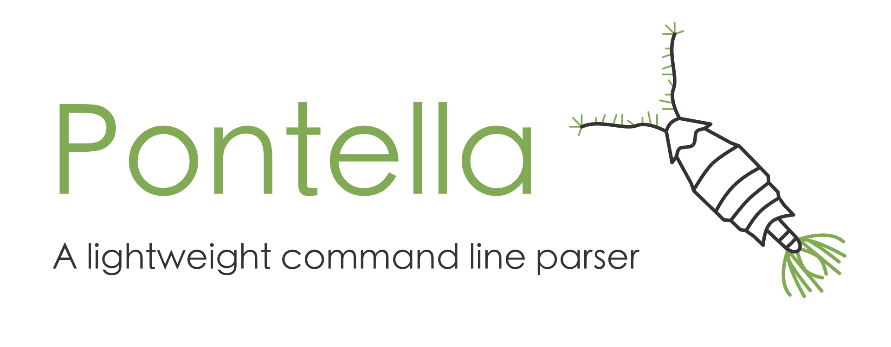

Pontella is a lightweight command line parser.

# install

Within a Git repository, run the commands:

```sh
mkdir -p third_party
cd third_party
git submodule add https://github.com/neuromorphic-paris/pontella.git
git submodule update --init --recursive
```

# user guide

Assuming the command line `./program /path/to/file --help --verbose 1`, Pontella can be called as follows:
```cpp
#include "../third_party/pontella/source/pontella.hpp"

int main(int argc, char* argv[]) {
    const auto command = pontella::parse(argc, argv, 1, {{"verbose", {"v"}}}, {"help", {"h"}});
    return 0;
}
```

The function `pontella::parse` has the signature:
```cpp
namespace pontella {
    /// parse turns argc and argv into parsed arguments and options.
    /// If numberOfArguments is negative, the number of arguments is unlimited.
    command parse(
        int argc,
        char* argv[],
        int64_t number_of_arguments,
        std::initializer_list<label> options,
        std::initializer_list<label> flags);
}
```

- `argc` is the program's `argc` passed to the main function.
- `argv` is the program's `argv` passed to the main function.
- `number_of_arguments` is the expected number of positional arguments. If the incorrect number of arguments is passed to the program, `pontella::parse` will throw an exception. To allow any number of arguments, set `number_of_arguments` to `-1`.
- `options` lists the available options (named arguments with a parameter) and their aliases (each option can have any number of aliases).
- `flags` lists the available flags (named arguments without parameter) and their aliases (each flag can have any number of aliases).

The type `pontella::label` represents an option or a flag, and is defined as:
```cpp
namespace pontella {
    /// label represents an option or flag name, and its aliases.
    struct label {
        std::string name;
        std::unordered_set<std::string> aliases;
    };
}
```

The returned `pontella::command` is defined by:
```cpp
namespace pontella {
    /// command contains parsed arguments, options and flags.
    struct command {

        /// arguments contains the positional arguments given to the program.
        std::vector<std::string> arguments;

        /// options contains the named options and the associated parameter given to the program.
        std::unordered_map<std::string, std::string> options;

        /// flags contains the named flags given to the program.
        std::unordered_set<std::string> flags;
    };
}
```

An an example, to check wether help is requested, one can write:
```cpp
#include "../third_party/pontella/source/pontella.hpp"

int main(int argc, char* argv[]) {
    const auto command = pontella::parse(argc, argv, 1, {{"verbose", {"v"}}}, {{"help", {"h"}}});

    if (command.flags.find("help") != command.flags.end()) {
        // display help here
    }

    return 0;
}
```

`pontella::parse` may throw two kinds of exceptions: `std::logic_error` are thrown when the options and flags chosen by the programer are not valid, whereas `std::runtime_error` are thrown when the arguments given by the user do not match the options and flags.

Pontella authorizes the following syntaxes for options:
  - `./program /path/to/file --help --verbose 1`
  - `./program /path/to/file --help --verbose=1`
  - `./program /path/to/file --help -verbose 1`
  - `./program /path/to/file --help -verbose=1`
  - `./program /path/to/file --help --v 1`
  - `./program /path/to/file --help --v=1`
  - `./program /path/to/file --help -v 1`
  - `./program /path/to/file --help -v=1`

Pontella authorizes the following syntaxes for flags:
  - `./program /path/to/file --help --verbose 1`
  - `./program /path/to/file -help --verbose 1`
  - `./program /path/to/file --h --verbose 1`
  - `./program /path/to/file -h --verbose 1`

All the positions for options and flags are possible:
  - `./program /path/to/file --help --verbose 1`
  - `./program /path/to/file --verbose 1 --help`
  - `./program --help /path/to/file --verbose 1`
  - `./program --help --verbose 1 /path/to/file`
  - `./program --verbose 1 /path/to/file --help`
  - `./program --verbose 1 --help /path/to/file`

The function `pontella::main` automatically adds an `help` flag (with alias `h`), and shows the specified message when exceptions are thrown (either by `pontella::parse` or the handler function):
```cpp
#include "../third_party/pontella/source/pontella.hpp"

int main(int argc, char* argv[]) {
    return pontella::main(
        {"This program does not do much",
         "Syntax: ./program [options]",
         "Available options:",
         "    -h, --help    shows this help message"},
        argc,
        argv,
        0,
        {},
        {},
        [](pontella::command command) {
            // your application goes there
        });
}
```

The `pontella::main` function has the signature:
```cpp
namespace pontella {
    /// main wraps error handling and message display.
    template <typename HandleCommand>
    inline int main(
        std::initializer_list<std::string> lines,
        int argc,
        char* argv[],
        int64_t number_of_arguments,
        std::initializer_list<label> options,
        std::initializer_list<label> flags,
        HandleCommand handle_command);
}
```

- `lines` is a list of strings joined with the line break character to generate the help message.
- `argc` is the program's `argc` passed to the main function.
- `argv` is the program's `argv` passed to the main function.
- `number_of_arguments` is the expected number of positional arguments. If the incorrect number of arguments is passed to the program, `pontella::parse` will throw an exception. To allow any number of arguments, set `number_of_arguments` to `-1`.
- `options` lists the available options (named arguments with a parameter) and their aliases (each option can have any number of aliases).
- `flags` lists the available flags (named arguments without parameter) and their aliases (each flag can have any number of aliases). The flag `help` (with alias `h`) is added internally before calling `pontella::parse`.
- `handle_command` must be compatible with the expression `handle_command(pontella::command)`.

More control can be achieved with manual error handling:
```cpp
#include "../third_party/pontella/source/pontella.hpp"

int main(int argc, char* argv[]) {
    pontella::label help{"help", {"h"}};
    auto show_help = false;
    try {
        const auto command = pontella::parse(argc, argv, 1, {{"verbose", {"v"}}}, {help});
        if (command.flags.find("help") != command.flags.end()) {
            show_help = true;
        } else {
            const auto verbose = std::stoull(verboseCandidate->second);
            if (verbose > 3) {
                throw std::runtime_error("'verbose' must be in the range [0, 2]");
            }
        }
    } catch (const std::runtime_error& exception) {
        show_help = true;
        if (!pontella::test(argc, argv, help)) {
            std::cerr << exception.what() << std::endl;
        }
    }
    if (show_help) {
        std::cerr << "Syntax: ./program [options]\n"
                     "Available options:\n"
                     "    -v [level], --verbose [level]   defines the verbose level (defaults to 0)\n"
                     "    -h, --help                      shows this help message\n"
                  << std::endl;
        return 1;
    }
    return 0;
}
```

This example uses the function `pontella::test`, with the signature:
```cpp
namespace pontella {
    /// test determines wether the given flag was used.
    /// It is meant to be used to hide the error message when a specific flag (such as help) is given.
    /// This method does not work with options.
    bool test(int argc, char* argv[], const label& flag);
}
```

# contribute

## development dependencies

### Debian / Ubuntu

Open a terminal and run:
```sh
sudo apt install premake4 # cross-platform build configuration
sudo apt install clang-format # formatting tool
```

### macOS

Open a terminal and run:
```sh
brew install premake # cross-platform build configuration
brew install clang-format # formatting tool
```
If the command is not found, you need to install Homebrew first with the command:
```sh
ruby -e "$(curl -fsSL https://raw.githubusercontent.com/Homebrew/install/master/install)"
```

### Windows

Download and install:
- [Visual Studio Community](https://visualstudio.microsoft.com/vs/community/). Select at least __Desktop development with C++__ when asked.
- [git](https://git-scm.com)
- [premake 4.x](https://premake.github.io/download.html). In order to use it from the command line, the *premake4.exe* executable must be copied to a directory in your path. After downloading and decompressing *premake-4.4-beta5-windows.zip*, run from the command line:
```sh
copy "%userprofile%\Downloads\premake-4.4-beta5-windows\premake4.exe" "%userprofile%\AppData\Local\Microsoft\WindowsApps"
```

## test

To test the library, run from the *pontella* directory:
```sh
premake4 gmake
cd build
make
cd release
./pontella
```

__Windows__ users must run `premake4 vs2010` instead, and open the generated solution with Visual Studio.

After changing the code, format the source files by running from the *pontella* directory:
```sh
clang-format -i source/pontella.hpp
clang-format -i test/pontella.cpp
```

__Windows__ users must run *Edit* > *Advanced* > *Format Document* from the Visual Studio menu instead.

# license

See the [LICENSE](LICENSE.txt) file for license rights and limitations (GNU GPLv3).
